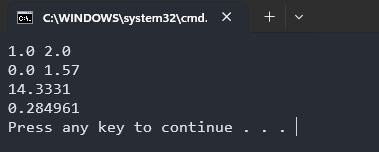
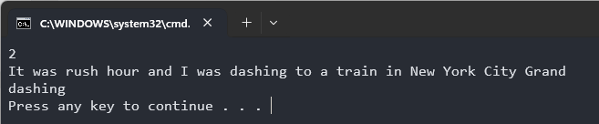

# cookbook

## Q（A）

#### 参考的答案错误源代码如下：

```c
#include <stdio.h>
#include <math.h>
#define n 10000

double f1(double x);
double f2(double x);
double definiteIntegral(double (*f)(double), double a, double b);

int main() 
{
    double a1, b1,a2, b2;
    scanf("%lf %lf", &a1, &b1);
	//getchar(); 
	scanf("%lf %lf", &a2, &b2);


    //f1(x)
    double result1 = definiteIntegral(f1, a1, b1);
    printf("%.4lf\n", result1);

    //f2(x)
    double result2 = definiteIntegral(f2, a2, b2);
    printf("%lf",  result2);

    return 0;
}

double f1(double x) {
    return x * x + 2 * x + 9;
}

double f2(double x) {
    return sin(x / 2) * sin(x / 2);
}

double definiteIntegral(double (*f)(double), double a, double b) 
{
    double sum = 0.0;
    double width = (b - a) / n;
    for (int i = 0; i < n; i++) {
        double x = a + i * width;
        sum += f(x)* width;
    }
    return sum;
}
```

#### 运行结果：




#### wa的原因：

结果的精度略高于正确结果。大概是因为printf的精度和cpp中的cout的精度不一样，这道题我印象中原本是给cpp做的，不用特殊考虑处理精度。但是现在拿过来给c做，需要人为控制一下精度，在主函数中做如下修改就能ac了。

#### 修正：

```c
int main() 
{
    double a1, b1,a2, b2;
    scanf("%lf %lf", &a1, &b1);
	//getchar(); 
	scanf("%lf %lf", &a2, &b2);

    //f1(x)
    double result1 = definiteIntegral(f1, a1, b1);
    printf("%.4lf\n", result1);

    //f2(x)
    double result2 = definiteIntegral(f2, a2, b2);
    printf("%lf",  result2);

    return 0;
}
```

其实是题目的问题，不用太纠结，知道怎么控制精度就可以了qwq


## Q（G）

#### 参考的运行时异常源代码如下：

```c
#include <stdio.h>

int circle(int num);

int main()
{
	int n;
	scanf("%d ",&n);
	while(n--){
		int num,t;
		scanf("%d ",&num);
		t=circle(num);
		printf("%d\n",t);
	}
	return 0;
}


int circle(int num)
{
	int a=0,b=0,count=1;
	int arr[4],temp;
	int new_num;
		arr[0] = num / 1000;        
    	arr[1] = (num / 100) % 10;  
    	arr[2] = (num / 10) % 10;  
    	arr[3] = num % 10; 		
		for(int i = 0; i < 4; i++){
			for(int j = 0; j < 4-i; j++){
				if(arr[j] > arr[j+1]){
					temp = arr[j];
					arr[j] = arr[j+1];
					arr[j+1] = temp;
				}
			}
		}	
		a=arr[0]*1000+arr[1]*100+arr[2]*10+arr[3];
		b=arr[3]*1000+arr[2]*100+arr[1]*10+arr[0];
		new_num=a-b;
		
	while(num != new_num){
		arr[0] = new_num / 1000;        
    	arr[1] = (new_num / 100) % 10;  
    	arr[2] = (new_num / 10) % 10;  
    	arr[3] = new_num % 10; 		
		for(int i = 0; i < 4; i++){
			for(int j = 0; j < 4-i; j++){
				if(arr[j] > arr[j+1]){
					temp = arr[j];
					arr[j] = arr[j+1];
					arr[j+1] = temp;
				}
			}
		}	
		a=arr[0]*1000+arr[1]*100+arr[2]*10+arr[3];
		b=arr[3]*1000+arr[2]*100+arr[1]*10+arr[0];
		new_num=a-b;
		count++;				
	}
	return count;	
}
```

#### 存在的问题：

- ```c
  scanf("%d ",&n);scanf("%d ",&num);
  ```

  `scanf` 在遇到空白字符时，会跳过所有连续的空白字符，直到遇到第一个非空白字符为止。

- 数组越界

  ```c
  for(int i = 0; i < 4; i++){
  			for(int j = 0; j < 4-i; j++){
  				if(arr[j] > arr[j+1]){
  					temp = arr[j];
  					arr[j] = arr[j+1];
  					arr[j+1] = temp;
  				}
  			}
  }
  ```

  `arr`数组开的4，内层循环到j=4的时候会进行arr[4]和arr[5]的比较，这会导致数组越界的问题

  需要去规范一下冒泡排序的写法。

- 题意理解错误

  比较的是更新完的数字和上次更新前的数字，而不是和最开始的数字。
  
  ex：从1234出发，依次可以得到4321-1234=3087、8730-378=8352、8532-2358=6174，又回到了它自己。这里面的它自己是6174。
  
- new_number计算错误
  
  数组排序之后大的数字在后面，new_number应为b-a
  
  
  
#### 修正：
#####   main函数：

```c
int main()
{
	int n;
	scanf("%d",&n);
	while(n--){
		int num,t;
		scanf("%d",&num);
		t=circle(num);
		printf("%d\n",t);
	}
	return 0;
}
```

#####   circle函数：

```c
int circle(int num)
{
	int a=0,b=0,count=1;
	int arr[4],temp;
	int new_num;
		arr[0] = num / 1000;        
    	arr[1] = (num / 100) % 10;  
    	arr[2] = (num / 10) % 10;  
    	arr[3] = num % 10; 		
		for(int i = 0; i < 4; i++){
			for(int j = 0; j < 3-i; j++){
				if(arr[j] > arr[j+1]){
					temp = arr[j];
					arr[j] = arr[j+1];
					arr[j+1] = temp;
				}
			}
		}	
		a=arr[0]*1000+arr[1]*100+arr[2]*10+arr[3];
		b=arr[3]*1000+arr[2]*100+arr[1]*10+arr[0];
		new_num=b-a;
		
	while(num != new_num){
        num = new_num;
		arr[0] = new_num / 1000;        
    	arr[1] = (new_num / 100) % 10;  
    	arr[2] = (new_num / 10) % 10;  
    	arr[3] = new_num % 10; 		
		for(int i = 0; i < 4; i++){
			for(int j = 0; j < 3-i; j++){
				if(arr[j] > arr[j+1]){
					temp = arr[j];
					arr[j] = arr[j+1];
					arr[j+1] = temp;
				}
			}
		}	
		a=arr[0]*1000+arr[1]*100+arr[2]*10+arr[3];
		b=arr[3]*1000+arr[2]*100+arr[1]*10+arr[0];
		new_num=b-a;
		count++;				
	}
	return count;	
}
```

  

  


### Q(H)

####   参考的答案错误的源码如下：

```c
#include<stdio.h>
#include<string.h>

int word(char a);
void  MaxLenWord(char s[]);

int main()
{
	int t;
	scanf("%d",&t);
	while(t--){
		char s[1000];
		gets(s);
		MaxLenWord(s);	
	}
	return 0;
}


int word(char a){
	if ((a <= 'z' && a>='a') || (a <= 'Z' && a>='A')) {
		return 1;
	}
	else
	{
		return 0;
	}
}

void  MaxLenWord(char s[]) {
	int len=0;//长度
	int maxlen=0;//最长的
	int sign=0;  
	for (int  i = 0; i<=strlen(s); i++)
	{
		if (word(s[i])) {
			len++;
		}
		else
		{
			if (len>maxlen) {
				maxlen = len;
				sign = i -maxlen;
				len = 0;
			}
			len = 0;
		}
	}
	for (int k = 0; k <=maxlen; k++)
	{
		printf("%c", s[sign + k]);
	}
}
```

####  运行结果：



#### 存在问题：  

- get（）是一个已经弃用的函数，scanf会残留一个\n,get()第一次会直接把这个换行符给读进去
- MaxLenWord函数设计存在一些问题，比如没有考虑一句话中有多个长度最长的单词


#### 解决办法：

- scanf问题：
  - 添加一个getchar()读掉换行符
  
- 重构MaxLenWord函数

  

#### 完整的代码：

  ```c
  #include <stdio.h>
  #include <string.h>
  
  void MaxLenWord(char s[]) {
      int len = strlen(s);
      int maxLen = 0;
      int currentLen = 0;
      
      for(int i = 0; i <= len; i++) {
          if(s[i] == ' ' || s[i] == '\0') {
              if(currentLen > maxLen) {
                  maxLen = currentLen;
              }
              currentLen = 0;
          } else {
              currentLen++;
          }
      }
      
      currentLen = 0;
      int isFirst = 1;  
      
      for(int i = 0; i <= len; i++) {
          if(s[i] == ' ' || s[i] == '\0') {
              if(currentLen == maxLen) {
                  if(!isFirst) {
                      printf(" ");
                  }
                  for(int j = i - currentLen; j < i; j++) {
                      printf("%c", s[j]);
                  }
                  isFirst = 0;
              }
              currentLen = 0;
          } else {
              currentLen++;
          }
      }
      printf("\n");
  }
  
  int main() {
      int t;
      char s[1000];
      
      scanf("%d", &t);
      getchar();  
      
      while(t--) {
          //fgets(s, sizeof(s), stdin);
          gets(s);
          MaxLenWord(s);
      }
      
      return 0;
  }
  ```

  
